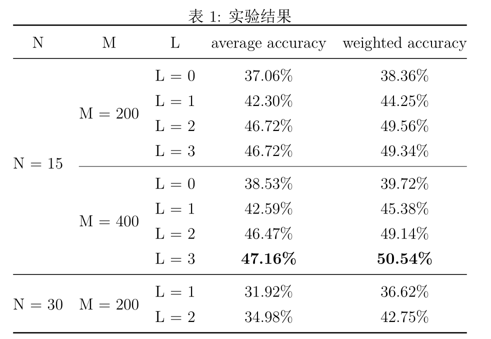

# SpatialPyramidMatching 

Simple implementation of Sptial Pyramid Matching Methods[1] with `numpy`, `scikit-learn` and `opencv-python`. Tested on `Caltech101`.  

## requirements

+ python >= 3.6.10
+ numpy >= 1.18
+ opencv-python >= 4.3.0
+ opencv-contrib-python >= 4.3.0
+ scikit-learn >= 0.22
+ tqdm

Lower version would often work too, but mind the version of `opencv-python`, since I use `xfeature2d.SIFT_create()` to extract dense sift features, and better check its version if it does not work as expected concerning the problem of patent. 

## Content

+ utils.py: util functions
+ data.py: loading `Caltech101` dataset.
+ spm.py: `SpatialPyramidClassifier` class for classify images based on `SpatialPyramidMatching` kernel function. More details in the file.

## Mind

+ The work is only a demo without much optimization, and it's very **memory consuming while trained on large dataset**.
+ I recommand precomputed features for saving time in extracting features.

## Results

The result is much lower than [1] reports. I simply use the default configuration of `svm` and `KMeans`, and **have not** make further hyperparmeter exploration. 

Here are some contrasive results in terms of `M` and `L`. Note that in terms of images for each classs in training, I designed 2 configuration: 15 and 30, respectively 20 and 50 images in testing. Since 30 images in training is far time consuming.

## Pretrained models

Classifier and cluster models trained with `N = 15, M = 200, L = 2`: [Link](https://pan.baidu.com/s/1aHOz3xUVjCyPVacjq-zcRA) and password: sjhd. 

## Reference.

[1] S. Lazebnik, C. Schmid and J. Ponce, "Beyond Bags of Features: Spatial Pyramid Matching for Recognizing Natural Scene Categories," 2006 IEEE Computer Society Conference on Computer Vision and Pattern Recognition (CVPR'06), New York, NY, USA, 2006, pp. 2169-2178, doi: 10.1109/CVPR.2006.68.